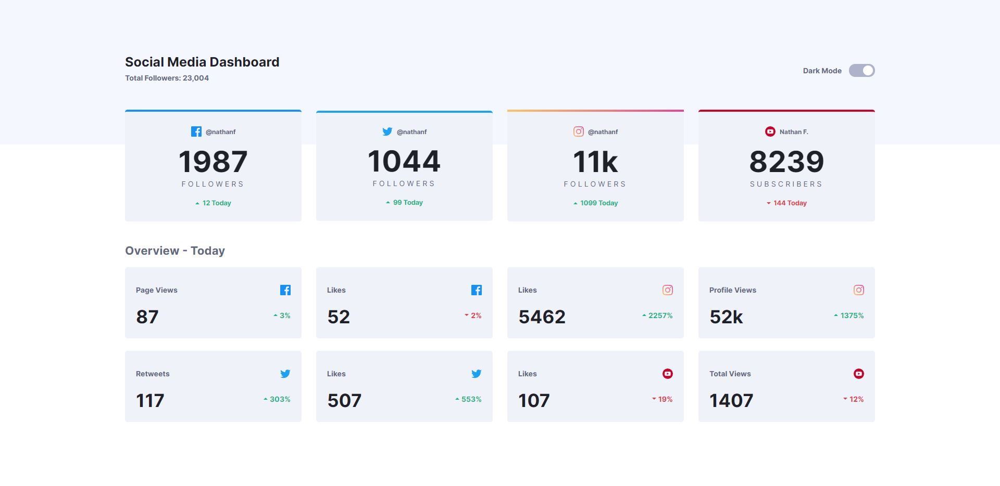
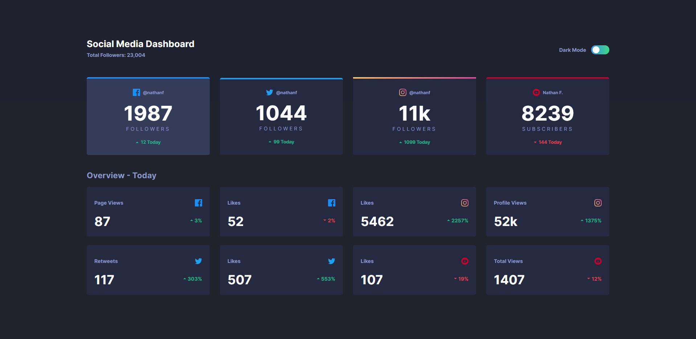

# Frontend Mentor - Social media dashboard with theme switcher solution

This is a solution to the [Social media dashboard with theme switcher challenge on Frontend Mentor](https://www.frontendmentor.io/challenges/social-media-dashboard-with-theme-switcher-6oY8ozp_H). Frontend Mentor challenges help you improve your coding skills by building realistic projects. 

## Table of contents

- [Overview](#overview)
  - [The challenge](#the-challenge)
  - [Screenshot](#screenshot)
  - [Links](#links)
- [My process](#my-process)
  - [Built with](#built-with)
  - [Useful resources](#useful-resources)
- [Author](#author)

**Note: Delete this note and update the table of contents based on what sections you keep.**

## Overview

### The challenge

Users should be able to:

- View the optimal layout for the site depending on their device's screen size
- See hover states for all interactive elements on the page
- Toggle color theme to their preference

### Screenshot

### Links

- [Solution](https://your-solution-url.com)
- [Live Site](https://ezevasari.github.io/social-media-dashboard-challenge/)

## My process

### Built with

- Semantic HTML5 markup
- CSS custom properties
- Flexbox
- CSS Grid
- Mobile-first workflow

### Useful resources

- [Create A Dark/Light Mode Switch with CSS Variables](https://dev.to/ananyaneogi/create-a-dark-light-mode-switch-with-css-variables-34l8) - This helped me for dark mode.

## Author

- Linkedin - [Linkedin](https://www.linkedin.com/in/ernesto-vasari-13b366185/)
- Frontend Mentor - [@ezevasari](https://www.frontendmentor.io/profile/EzeVasari)
- Twitter - [@ezevasari](https://www.twitter.com/ezevasari)
